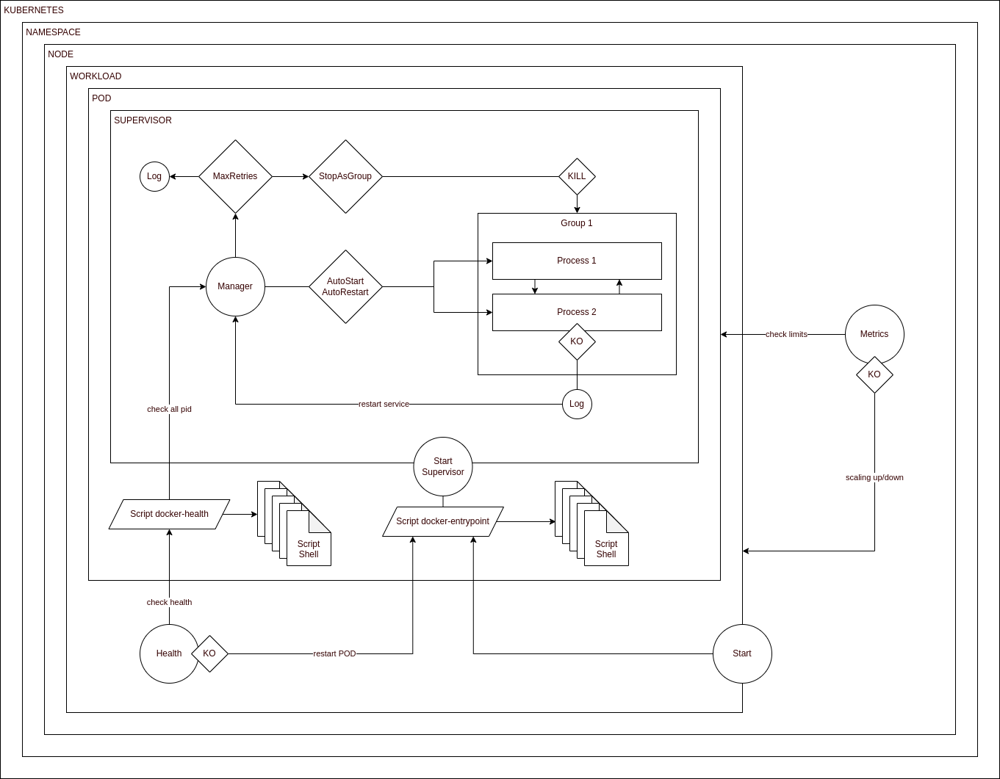

# OPS DEBIAN

Create your linux debian templates in an automated way 

Include supervisord stack

@see : http://supervisord.org

### Concept



### Terraform Versions

```json
{
  "bullseye": {
    "variants": [
      "slim"
    ],
    "version": "bullseye"
  },
  "buster": {
    "variants": [
      "slim"
    ],
    "version": "buster"
  }
}
```

### Requirements

```shell
# Install JQ
sudo apt-get install jq
```

### Usage

Edit dockerfile.template

```shell
# Update all versions
bash run-update.sh
```

```shell
# Build all docker images
bash run-build.sh
```

### Env Configuration

```dotenv
SUPERVISOR_LOG_LEVEL="warn" \
SUPERVISOR_LOG_FILE="/proc/self/fd/1" \
SUPERVISOR_USERNAME="rootless" \
SUPERVISOR_PASSWORD="nopassword" \
SUPERVISOR_FILES="/etc/supervisor/conf.d/*.conf"
```

### Test

```shell
docker run -it --rm --name ops-debian adeo/ops-debian/bullseye:slim supervisorctl help
```

### Terraform

```dockerfile
FROM adeo/ops-debian/bullseye:slim

USER root

COPY --chown=rootless:rootless docker/docker-*.sh /usr/bin

RUN chmod +x /usr/bin/docker-*

RUN set -eux; \
echo "docker-entrypoint-custom-1.sh" >> /docker-entrypoint.list; \
echo "docker-entrypoint-custom-2.sh" >> /docker-entrypoint.list

RUN set -eux; \
echo "docker-health-custom-1.sh" >> /docker-health.list; \
echo "docker-health-custom-2.sh" >> /docker-health.list

COPY --chown=rootless:rootless supervisor/*.conf /etc/supervisor/conf.d

ENTRYPOINT ["docker-entrypoint.sh"]

STOPSIGNAL SIGQUIT

CMD ["supervisord"]

USER rootless
```

### Health Check

```shell
until docker-health.sh >/dev/null 2>&1; do (>&2 echo "Waiting supervisor processes..."); sleep 1; done
```

Usage 

@see https://rancher.com/docs/rancher/v2.0-v2.4/en/v1.6-migration/monitor-apps/#additional-probing-options

```shell
/usr/bin/docker-health.sh
```
